# Home IT & Network Lab

A hands-on lab built in VirtualBox with a Windows VM and an Ubuntu VM, covering secure remote access, host firewalls, user permissions and network traffic analysis. Every section includes the problems I ran into and how I diagnosed them.

| Part | Focus |
|---|---|
| [Part 1: Tailscale mesh VPN & SSH](#part-1-tailscale-mesh-vpn--ssh) | WireGuard-based VPN, MagicDNS, SSH with host key verification and key-only authentication |
| [Part 2: Firewalls & user permissions](#part-2-firewalls--user-permissions) | UFW on Ubuntu, Windows Defender Firewall, standard vs admin users |
| [Part 3: Traffic analysis with Wireshark](#part-3-traffic-analysis-with-wireshark) | DNS, ICMP, HTTP vs HTTPS, and what VPN traffic looks like on the wire |

## Environment

| Component | Details |
|---|---|
| Hypervisor | Oracle VirtualBox (VMs on NAT networking) |
| Node 1 | Windows VM |
| Node 2 | Ubuntu 26.04 LTS VM |
| VPN | Tailscale (WireGuard-based mesh VPN), free Personal plan |
| Remote access | OpenSSH server on Ubuntu, built-in OpenSSH client on Windows |
| Tools | UFW, iptables, Windows Defender Firewall (PowerShell), Wireshark |

---

# Part 1: Tailscale mesh VPN & SSH

## What I built

1. Created a Tailscale tailnet and joined both VMs to it.
2. Verified connectivity at three layers:
   - **Tailscale layer:** `tailscale ping` confirmed a **direct peer-to-peer connection over IPv6** (no relay), typically under 35 ms.
   - **IP layer:** standard ICMP `ping` from Ubuntu to Windows: 0% packet loss, low-millisecond latency after the first packet. The TTL of 128 confirmed the responder was the Windows host (Linux defaults to 64).
   - **Name resolution:** MagicDNS resolved the short hostname to the full tailnet name (`<host>.<tailnet>.ts.net`).
3. Installed and enabled OpenSSH server on Ubuntu and connected from Windows over the tailnet.
4. Before trusting the connection, **verified the SSH host key fingerprint** on the Ubuntu server against the one presented to the Windows client, which guards against man-in-the-middle attacks.
5. **Hardened SSH:** switched to key-based authentication and disabled password login.

**Both machines connected to the tailnet**

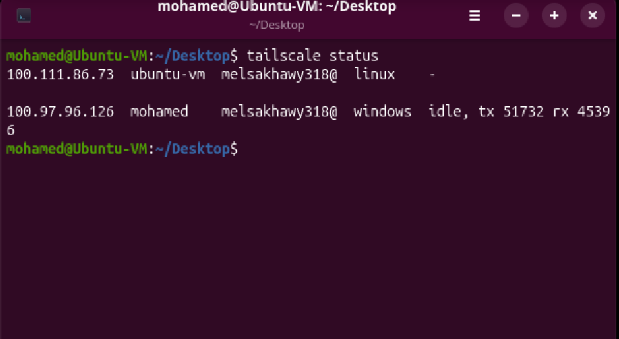

**Direct peer-to-peer connection confirmed with `tailscale ping`**

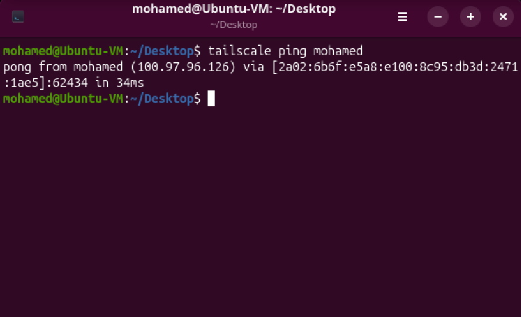

**Standard ICMP ping using the MagicDNS name: 0% packet loss, TTL 128 (Windows)**

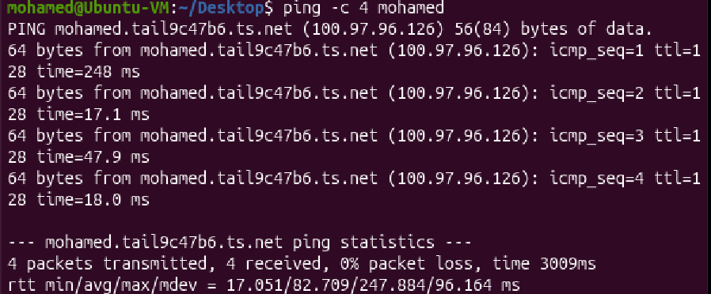

**Verifying the SSH host key fingerprint on the server**

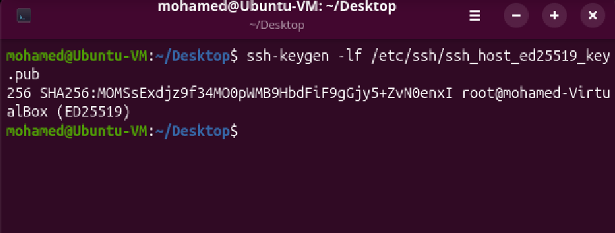

**SSH session from Windows into Ubuntu over the tailnet**

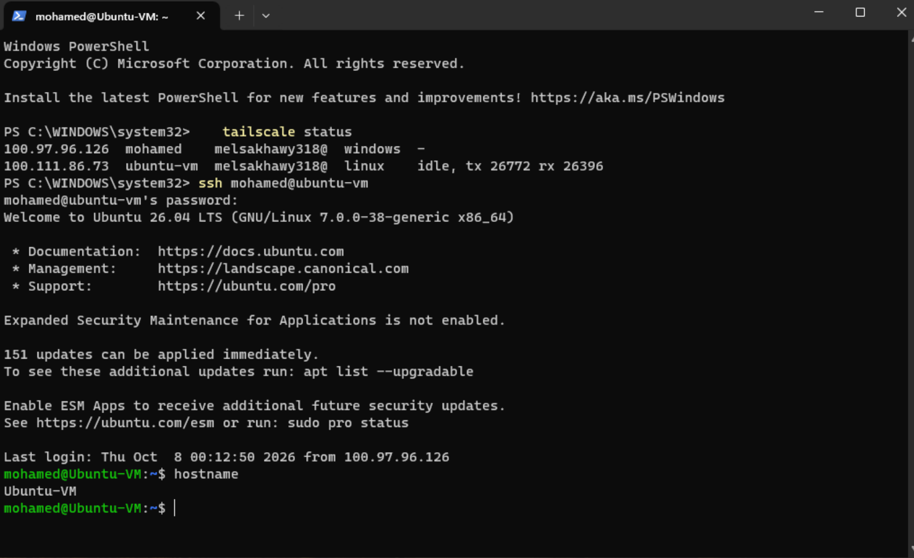

## SSH hardening

1. **Generated an Ed25519 key pair on Windows**, protected with a passphrase so the private key is useless if copied:
   ```powershell
   ssh-keygen -t ed25519 -C "windows-vm to ubuntu-vm"
   ```
2. **Installed the public key on Ubuntu** with correct permissions (`~/.ssh` at 700, `authorized_keys` at 600). Windows has no `ssh-copy-id`, so I piped the key over SSH:
   ```powershell
   type $env:USERPROFILE\.ssh\id_ed25519.pub | ssh mohamed@ubuntu-vm "mkdir -p ~/.ssh && chmod 700 ~/.ssh && cat >> ~/.ssh/authorized_keys && chmod 600 ~/.ssh/authorized_keys"
   ```
3. **Confirmed key login worked before disabling passwords**, to avoid locking myself out.
4. **Disabled password login** with a drop-in config file, `/etc/ssh/sshd_config.d/01-hardening.conf`:
   ```
   PasswordAuthentication no
   KbdInteractiveAuthentication no
   PermitRootLogin no
   PubkeyAuthentication yes
   ```
   The `01-` prefix matters: sshd processes drop-in files alphabetically and keeps the **first** value it sees, so this file takes priority over any default drop-ins that re-enable passwords.
5. **Validated and applied the config:** `sudo sshd -t` (syntax check), `sudo systemctl restart ssh`, then confirmed the effective settings with `sudo sshd -T`.
6. **Tested that password login is rejected** by forcing it from the client:
   ```powershell
   ssh -o PubkeyAuthentication=no mohamed@ubuntu-vm
   # Permission denied (publickey).
   ```

**Key-based login (prompts for the key passphrase, not the account password)**

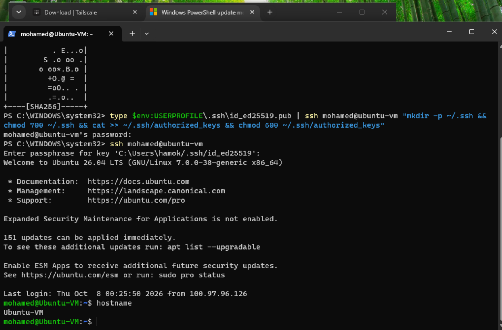

**Effective sshd settings after hardening**

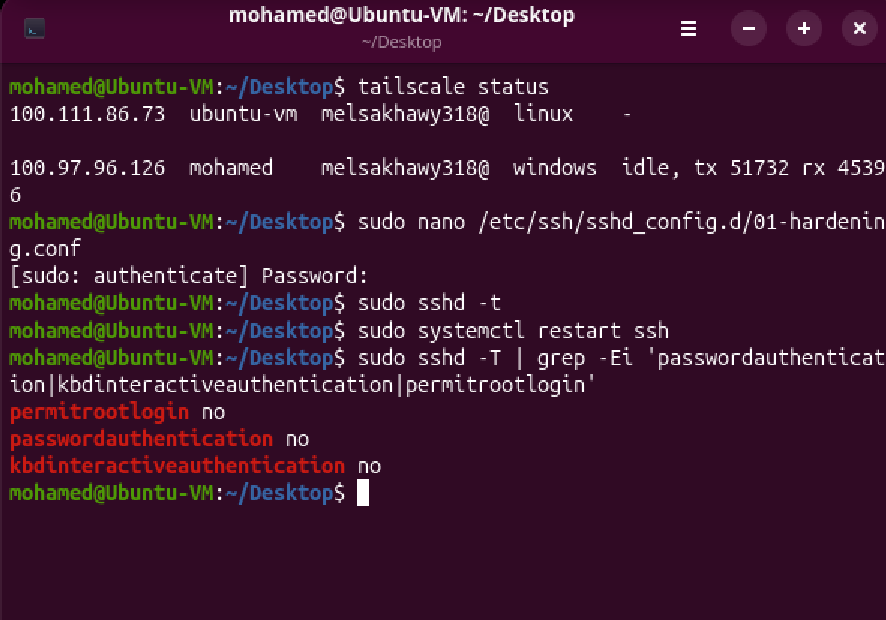

**Password login rejected**

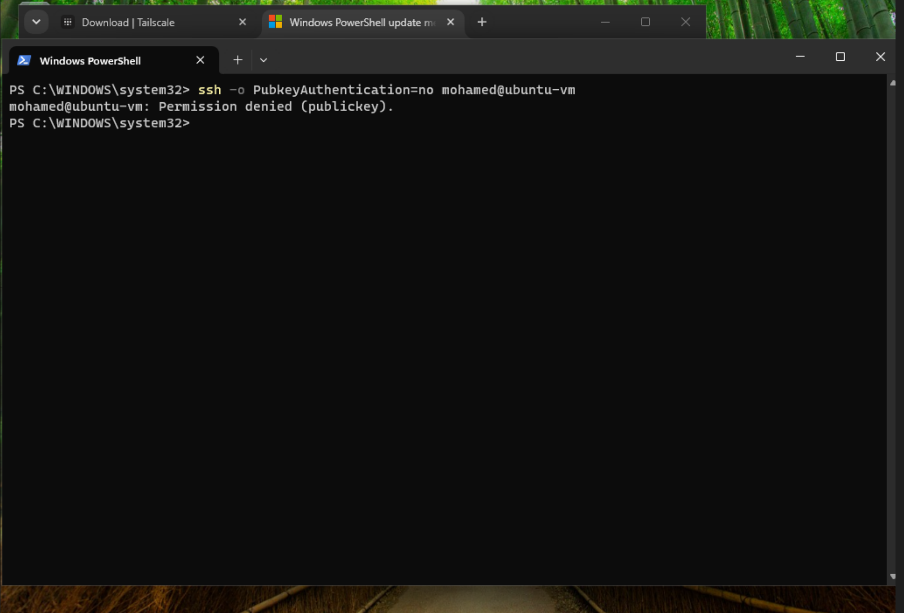

---

# Part 2: Firewalls & user permissions

## Ubuntu firewall (UFW)

**Goal:** deny all inbound traffic except SSH, and only allow SSH over the Tailscale interface.

I started a temporary web server as a test target (`python3 -m http.server 8080`) and used `Test-NetConnection` from Windows to check which ports were reachable.

**Baseline: both ports reachable over Tailscale**

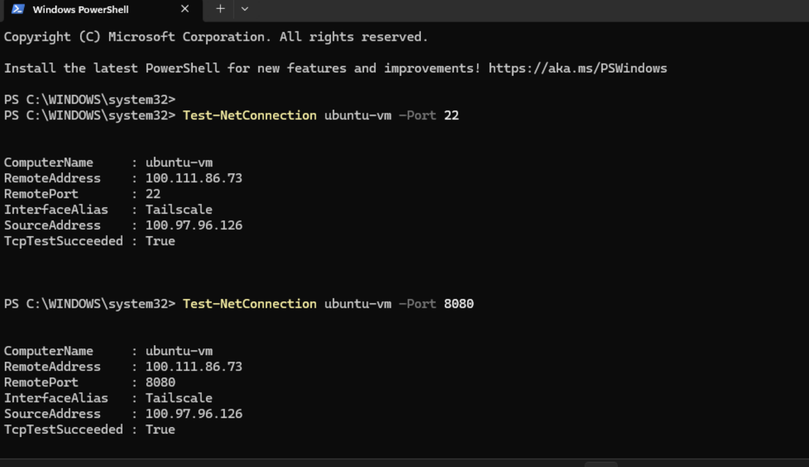

I then applied the policy:
```bash
sudo ufw default deny incoming
sudo ufw default allow outgoing
sudo ufw allow in on tailscale0 to any port 22 proto tcp
sudo ufw logging on
sudo ufw enable
```

**Auditing existing rules.** `ufw status verbose` showed leftover rules from an earlier lab: `22/tcp ALLOW IN Anywhere` (SSH open on every interface, which undermined the Tailscale-only rule), `80/tcp ALLOW IN Anywhere` (an unused open port) and a redundant `23/tcp DENY`. I removed all three.

**Final ruleset: only SSH over Tailscale is allowed in**

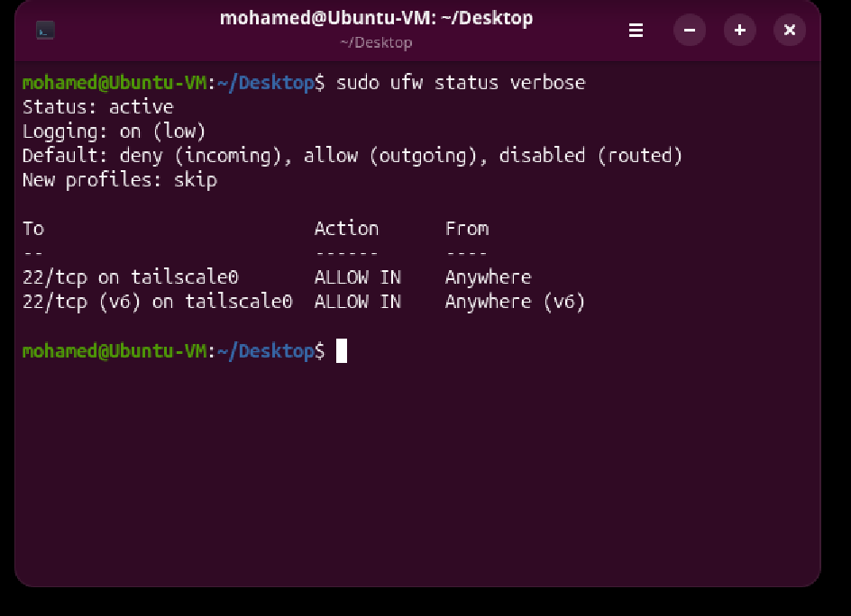

### Finding: UFW was not filtering Tailscale traffic

After enabling UFW, port 8080 was **still reachable** from Windows. I checked the kernel's rule order:

```bash
sudo iptables -S INPUT
sudo iptables -S ts-input
```

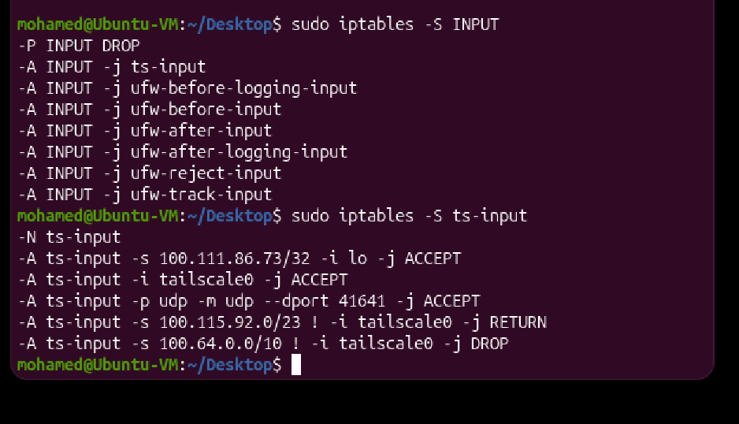

Every incoming packet jumps to Tailscale's `ts-input` chain **before** any UFW chain, and `ts-input` contains `-i tailscale0 -j ACCEPT`. All traffic arriving over the tailnet was accepted before UFW ever saw it, so my UFW rules only applied to the normal network interface.

**Fix:** told Tailscale to keep its chains but stop diverting `INPUT` traffic through them, and allowed Tailscale's UDP port so direct peer connections still work:
```bash
sudo tailscale set --netfilter-mode=nodivert
sudo ufw allow 41641/udp
```

**After the fix: SSH allowed, port 8080 blocked**

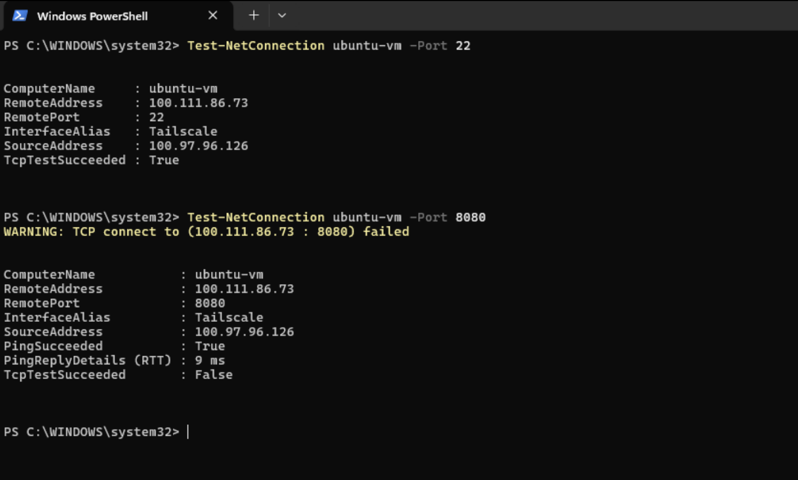

`PingSucceeded: True` is expected: UFW permits ICMP echo requests by default (`/etc/ufw/before.rules`).

**Trade-off:** `ts-input` also dropped spoofed `100.64.0.0/10` traffic arriving on non-Tailscale interfaces, which no longer applies automatically in `nodivert` mode. That's acceptable on a lab VM behind NAT. On a production server, the Tailscale-native approach is to restrict access with **Tailscale ACLs**. Reverting is one command: `sudo tailscale set --netfilter-mode=on`.

### Reading the firewall log

```bash
sudo journalctl -k | grep "UFW BLOCK" | tail -5
```

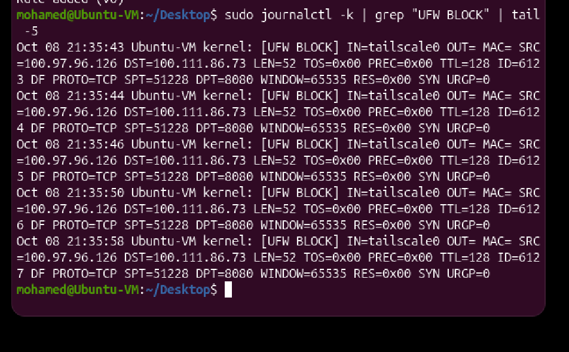

| Field | Value | Meaning |
|---|---|---|
| `IN` | `tailscale0` | Arrived over the VPN tunnel |
| `SRC` | `100.97.96.126` | The Windows VM |
| `DPT` | `8080` | Targeting the test web server |
| Flags | `SYN` | A new connection attempt, blocked before it was established |
| `TTL` | `128` | Consistent with a Windows sender |

All five entries share the **same source port (51228)** and arrive at 43s, 44s, 46s, 50s and 58s, so the gaps double each time (1, 2, 4, 8 seconds). This is one connection being **retried with TCP exponential backoff**, not five separate attempts.

## Windows Defender Firewall

**Goal:** block ping from the Ubuntu VM only, without affecting the VPN tunnel.

```powershell
New-NetFirewallRule -DisplayName "Lab - Block ping from ubuntu-vm" -Direction Inbound -Protocol ICMPv4 -IcmpType 8 -RemoteAddress 100.111.86.73 -Action Block
```

### Finding: the firewall was switched off

The rule was created successfully, but ping from Ubuntu **still got replies**:

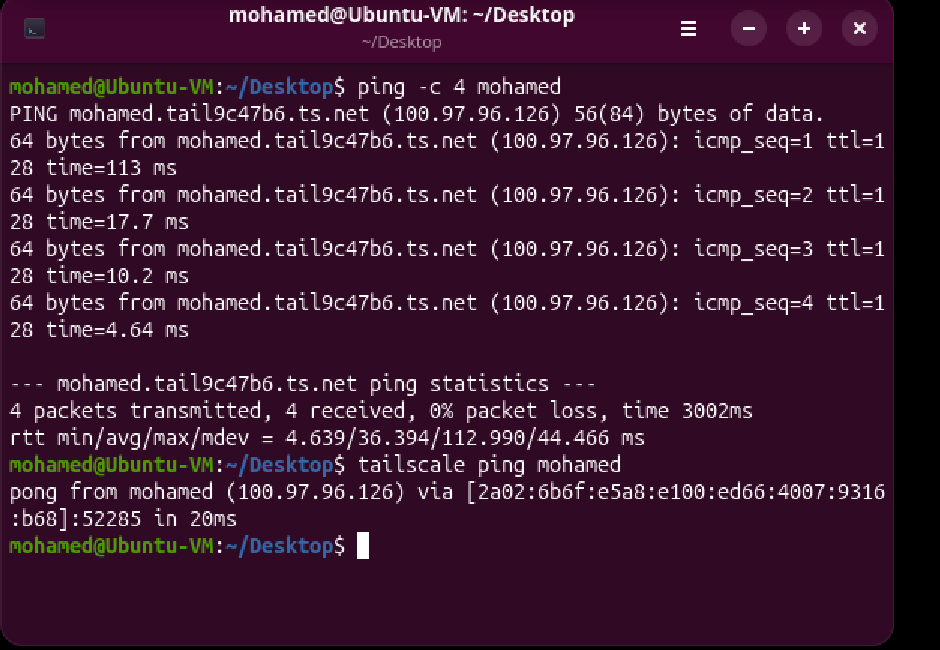

Checking the firewall profiles with `Get-NetFirewallProfile | Format-Table Name, Enabled` showed that **Domain, Private and Public were all disabled**. Windows wasn't enforcing any rules at all. This also explained why ping to Windows had worked without any configuration in Part 1.

**Fix:** re-enabled the firewall on all profiles:
```powershell
Set-NetFirewallProfile -Profile Domain,Private,Public -Enabled True
```

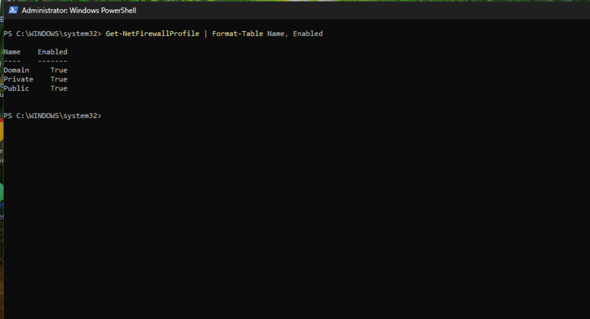

**With the firewall enforcing:** normal ping now gets 100% packet loss, while `tailscale ping` still works. The tunnel is healthy; Windows Firewall is dropping ICMP after it leaves the tunnel.

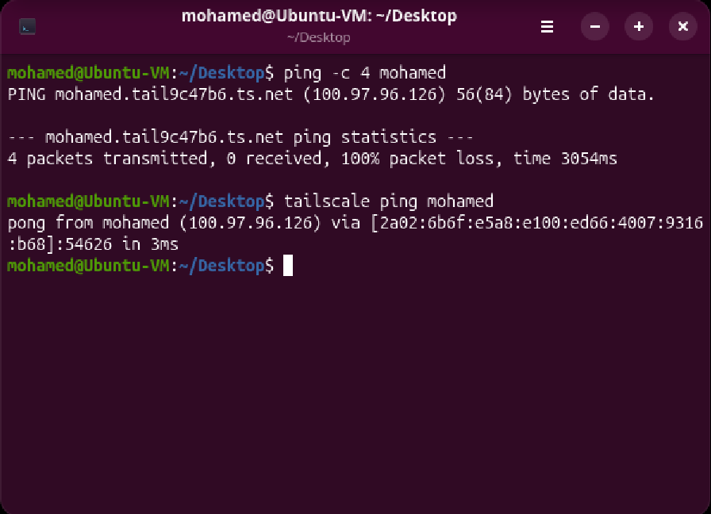

The lab rule was then removed. The firewall stays on, and ping over Tailscale still works through Windows' existing rules.

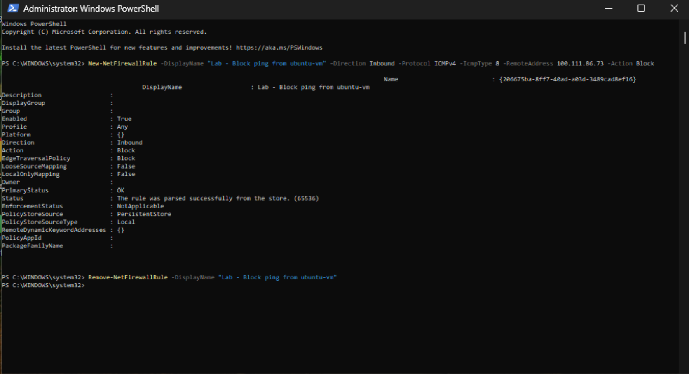

## User permissions (Ubuntu)

Created a standard user and confirmed it can't gain admin rights:
```bash
sudo adduser labuser
su - labuser
sudo ls /root
```

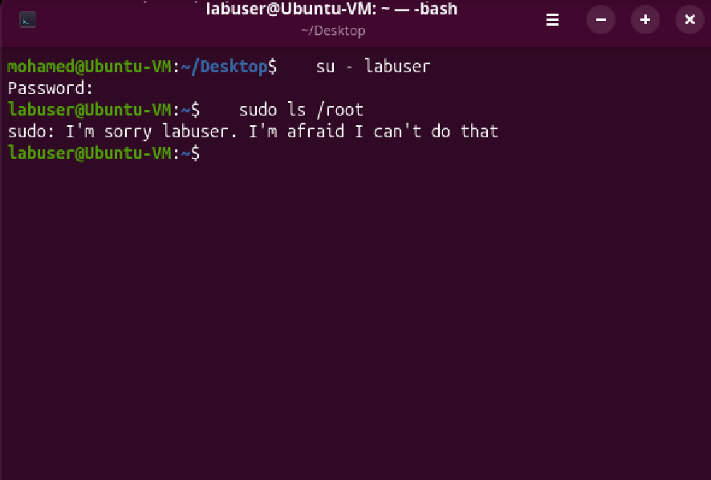

`groups` shows why: my admin account is a member of the `sudo` group; `labuser` is only in `labuser` and `users`.

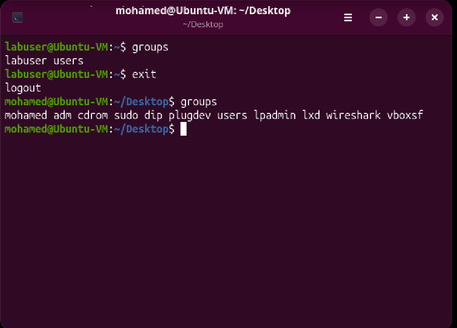

---

# Part 3: Traffic analysis with Wireshark

All captures were taken on the Ubuntu VM's NAT interface (`enp0s8`).

| Capture | Command | Filter |
|---|---|---|
| DNS | `nslookup example.com` | `dns` |
| ICMP | `ping -c 4 8.8.8.8` | `icmp` |
| HTTP | `curl http://neverssl.com` | `http` |
| HTTPS | `curl -s https://example.com > /dev/null` | `tls.handshake.type == 1` |
| VPN tunnel | `ping -c 4 mohamed` (over Tailscale) | `udp.port == 41641 && !stun` |

### DNS
Separate **A** (IPv4) and **AAAA** (IPv6) queries for `example.com`, answered by the home router (`192.168.1.1`) via VirtualBox NAT. The capture also shows background lookups, including Ubuntu's connectivity check and reverse (PTR) lookups for the VM's own private addresses, which return "No such name" as expected.

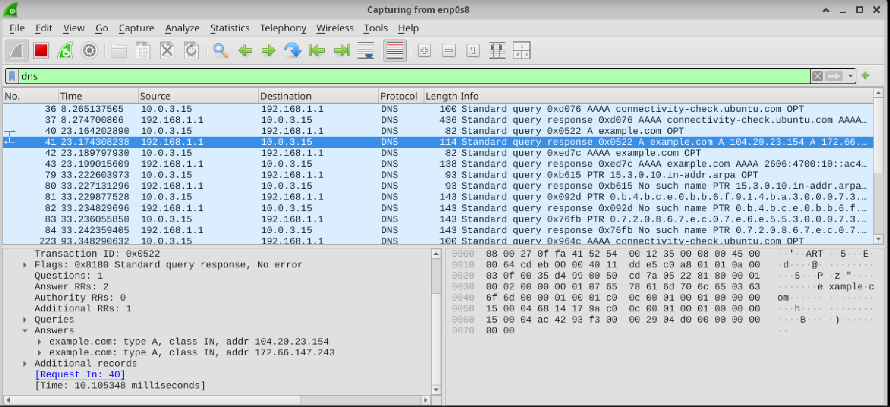

### ICMP
Each Echo request is paired with its reply by matching **id** and **seq** numbers. The capture also contains unexpected **Destination unreachable (Port unreachable)** and **Time-to-live exceeded** messages from the VirtualBox NAT gateway (`10.0.3.2`). These line up with Tailscale probing several possible paths to the Windows peer, where the failed paths are reported back by the gateway.

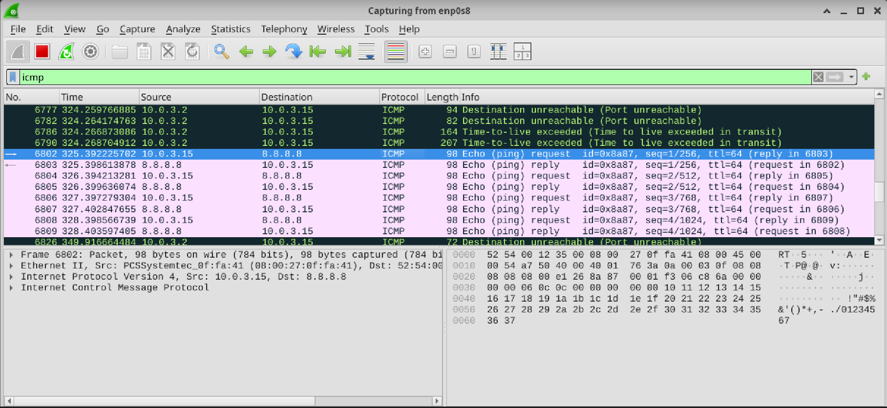

### HTTP: everything is readable
Following the HTTP stream shows the full request (`GET /`, `Host`, `User-Agent: curl`) and the server's response, including headers and HTML, in plain text. Anyone on the network path could read or modify it.

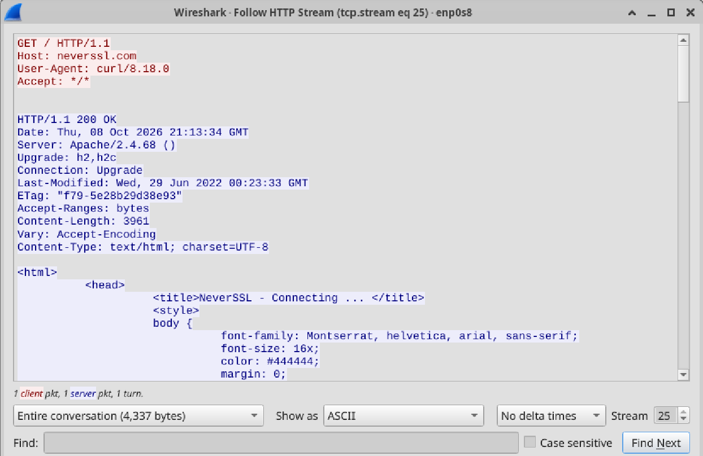

### HTTPS: only the destination name is visible
The TLS 1.3 **Client Hello** still exposes the site name in the **Server Name Indication (SNI)** extension (`example.com`), but everything after the handshake is encrypted. This is why security tools can flag connections to suspicious domains even when the content is encrypted.

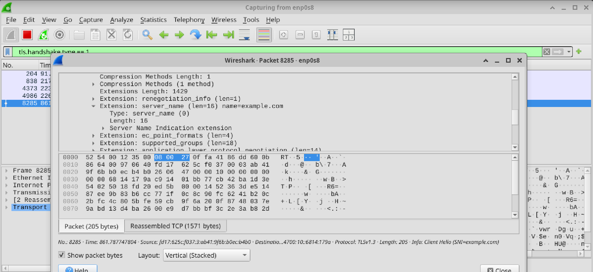

### What VPN traffic looks like on the wire
Pinging the Windows VM over Tailscale produces **no ICMP at all** on the physical interface, only UDP packets between the two hosts' IPv6 addresses. Using **Decode As → WireGuard**, Wireshark identifies them as WireGuard **Transport Data** messages. The steady 190-byte size matches identical pings wrapped with the same encryption overhead. A few packets on the same port don't decode as WireGuard; these are most likely Tailscale's own path-discovery ("disco") messages, which share the port but use a different format.

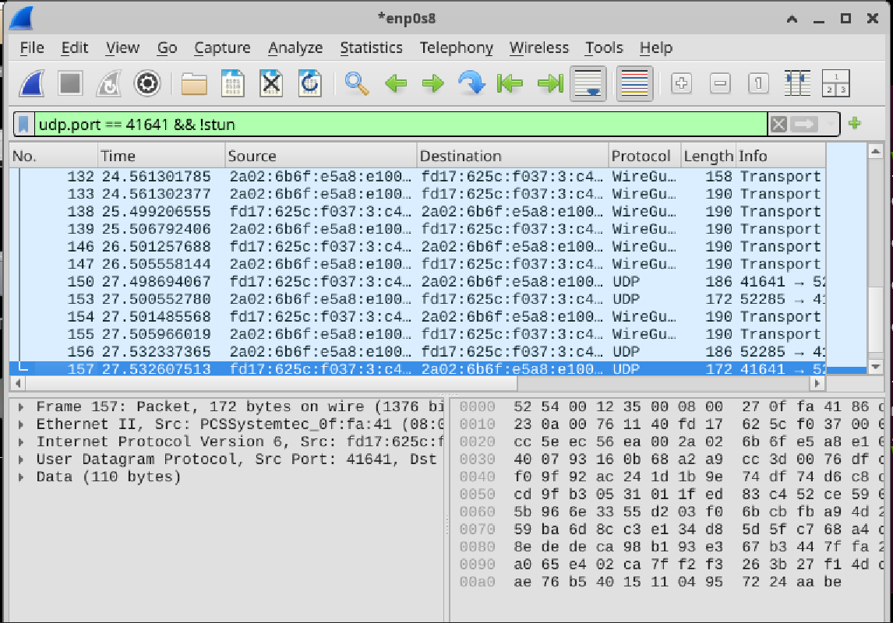

---

## Troubleshooting log

| Problem | Diagnosis | Fix |
|---|---|---|
| `apt` reported `Unable to locate package tailscale` after running the official install script | `sudo apt update` had no line for `pkgs.tailscale.com`, so the repository had never been added. Ubuntu 26.04 ("resolute") wasn't handled by the script | Manually added Tailscale's signing key and the Ubuntu 24.04 ("noble") repository, then installed the package |
| `curl: (35) Recv failure: Connection reset by peer` while downloading the signing key | The TLS handshake was being reset. Checked whether the issue was VM-specific or network-wide | Re-ran the download and it completed |
| Commands failed when pasted as one line (`sh: cannot open sudo`) | Two commands were joined, so `sh` treated `sudo` as a script file | Ran each command separately |
| `tailscale` not recognised in PowerShell | The PowerShell session was opened before installation, so it hadn't picked up the updated PATH | Opened a new session |
| `tailscale ping desktop-mohamed` failed with a DNS lookup error | Wrong hostname; `tailscale status` showed the node under a different name | Used the 100.x address, then the correct MagicDNS name |
| Two Windows devices in the tailnet after restoring a VM snapshot | Restoring the snapshot removed Tailscale's stored node identity, so re-joining created a new device | Removed the stale device in the admin console and renamed the active one |
| Port 8080 reachable over Tailscale despite UFW denying incoming traffic | `iptables -S` showed Tailscale's `ts-input` chain accepting all `tailscale0` traffic before UFW's chains | `tailscale set --netfilter-mode=nodivert` plus `ufw allow 41641/udp` |
| Leftover UFW rules allowing SSH and HTTP from anywhere | Audited `ufw status verbose` | Deleted the rules that contradicted the intended policy |
| Windows block rule had no effect | `Get-NetFirewallProfile` showed all three profiles disabled | Re-enabled the firewall on all profiles; the rule then worked |
| Ubuntu VM froze during a long Wireshark capture | Capture had run for about 40 minutes and held thousands of packets in memory on a low-RAM VM | Powered off the VM, increased its memory, and used short, targeted captures |
| Tunnel packets hard to find among background traffic | Tailscale sends frequent STUN packets on the same port | Filtered with `udp.port == 41641 && !stun` |

## What I learned

- How a mesh VPN differs from hub-and-spoke, and how Tailscale uses NAT traversal (STUN) to form direct connections behind NAT.
- The difference between testing the overlay network (`tailscale ping`) and normal IP traffic (`ping`), and how to use that difference to locate a fault.
- Why SSH host key verification and key-only authentication matter, and how sshd drop-in config precedence works.
- **Firewall rules must be tested, not assumed.** In both firewalls, the configuration looked correct but wasn't actually filtering: once because another product's rules ran first, and once because the firewall was disabled.
- How iptables chain order determines which rules apply, and how to read kernel firewall logs, including spotting TCP retransmission backoff.
- How group membership controls admin rights on Linux.
- What different protocols reveal on the wire: HTTP exposes everything, HTTPS still exposes the destination via SNI, and a VPN hides even the protocol being used.

## Next steps

- Replace `nodivert` mode with Tailscale ACLs so access control is enforced across the whole tailnet.
- Add Fail2ban, or bind SSH to the Tailscale interface only.
- Forward UFW and Windows Firewall logs to a central SIEM (for example Wazuh) and build alerts for blocked connection attempts.
